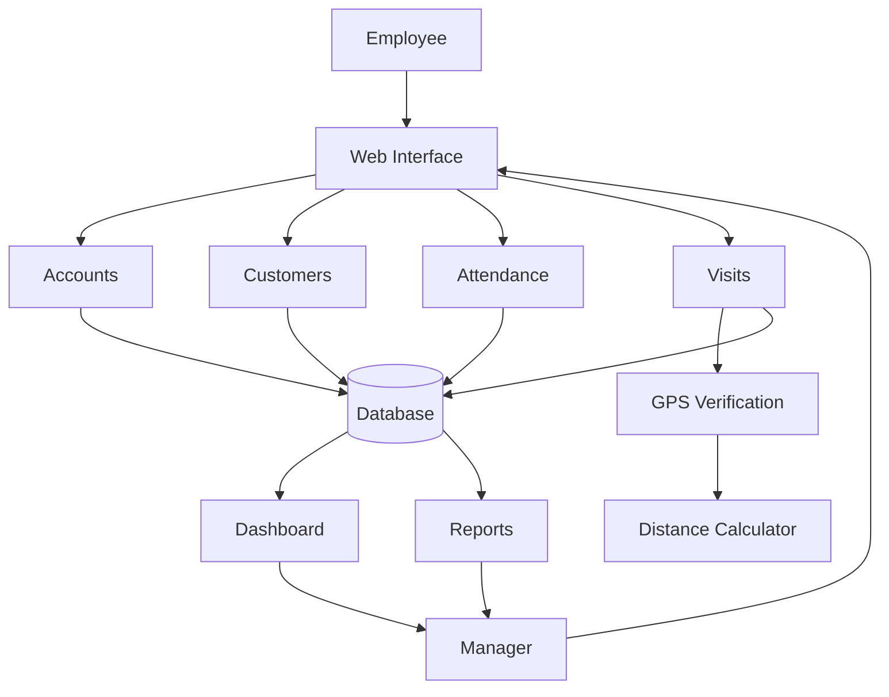
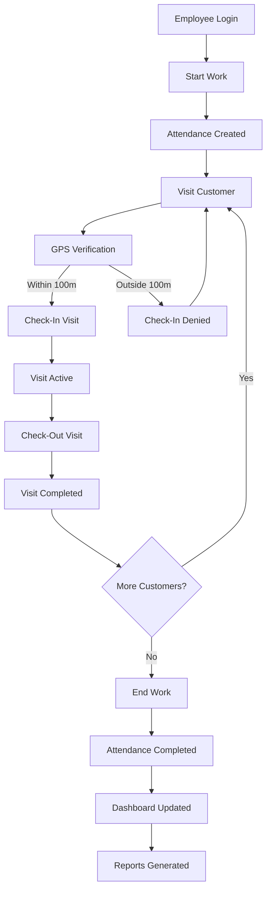
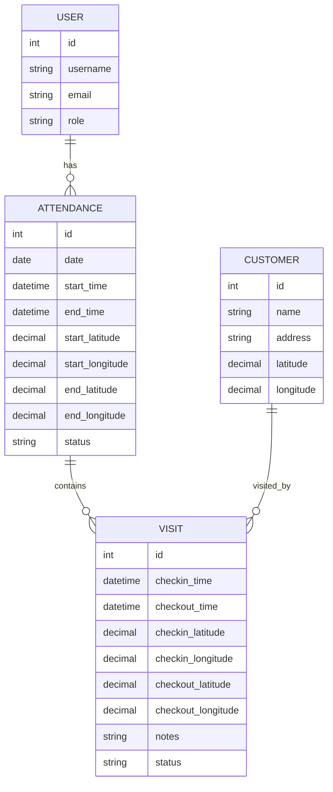

# System Architecture

## Architecture Diagram

# System Flow Diagram

# Entity Relationship Diagram

## Overview

The Field Sales Monitoring & Visit Verification System is designed to monitor employee attendance and verify customer visits using GPS coordinates.

The system follows a modular architecture where each Django application handles a specific business function.

---

# System Modules

## Accounts Module

Purpose:

- User Authentication
- Employee Management
- Role Management

Responsibilities:

- Login
- User Creation
- Employee Roles
- Admin Roles

---

## Customers Module

Purpose:

Store customer information and GPS coordinates.

Responsibilities:

- Customer Registration
- Customer Address Management
- Customer Latitude
- Customer Longitude

---

## Attendance Module

Purpose:

Track employee work attendance.

Responsibilities:

- Start Work
- End Work
- Attendance Status

Status Values:

- ACTIVE
- COMPLETED

---

## Visits Module

Purpose:

Track customer visits performed by employees.

Responsibilities:

- Customer Check-In
- Customer Check-Out
- Visit Duration Calculation
- GPS Verification

Status Values:

- CHECKED_IN
- COMPLETED

---

## Dashboard Module

Purpose:

Provide management overview.

Responsibilities:

- KPI Cards
- Recent Visits
- Recent Attendance
- Employee Performance Summary

---

## Reports Module

Purpose:

Provide detailed business reports.

Responsibilities:

- Visit Report
- Attendance Report

---

 

# GPS Verification Workflow

Employee Location

↓

Customer Location

↓

Distance Calculation

↓

Within 100 Meters?

├── Yes → Allow Check-In
│
└── No → Deny Check-In

---

# Technology Architecture

Frontend

- HTML
- CSS
- Bootstrap 5
 

Backend

- Python
- Django

 

Database

- SQLite

 
Future Production Database

- PostgreSQL

---

# Security Rules

1. Employee can start work only once per day.

2. Employee must have ACTIVE attendance before customer check-in.

3. Employee can have only one active visit at a time.

4. Employee must be within 100 meters of customer location.

5. Visit must be checked out before another visit can begin.

6. Attendance must be ended before the workday is completed.